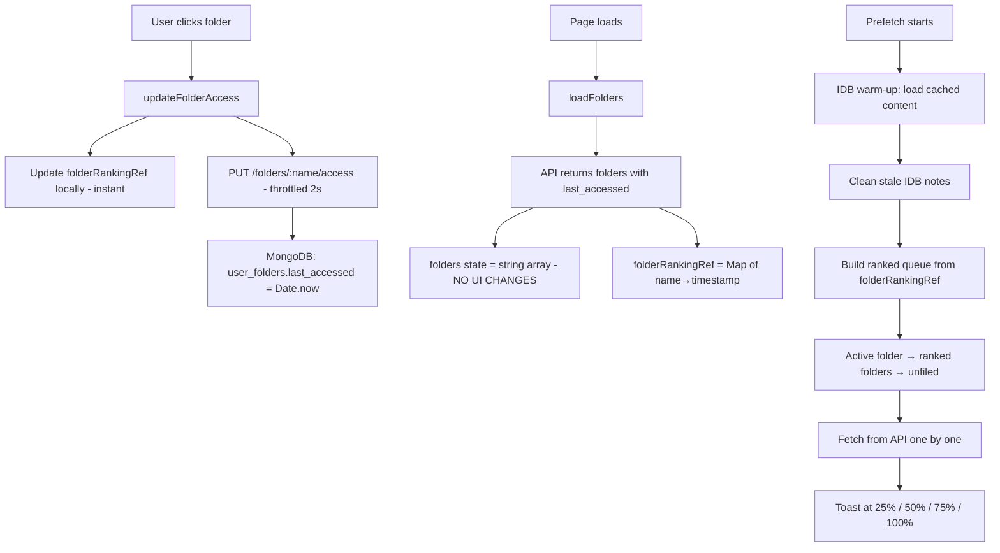
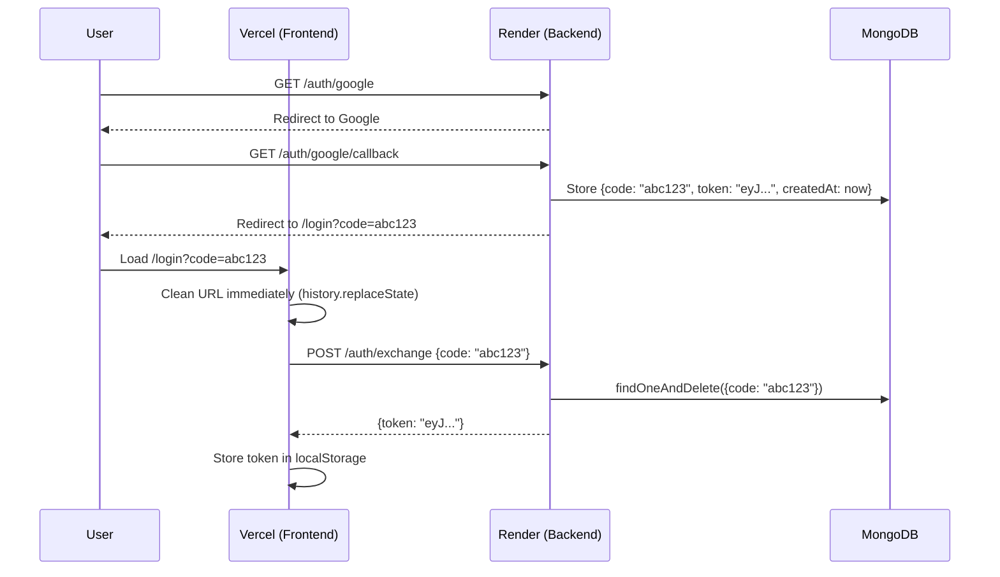

# NoteVault — Session Walkthrough (April 30, 2026)

> Complete documentation of all changes: Ranked Prefetching, Security Hardening, Feature Additions, and Deployment Configuration.

---

## Table of Contents

1. [Ranked Offline Prefetching](#1-ranked-offline-prefetching)
2. [Code Review Fixes (13 Items)](#2-code-review-fixes)
3. [OAuth Code Exchange (Security)](#3-oauth-code-exchange)
4. [Password Change Feature](#4-password-change-feature)
5. [Deployment Configuration](#5-deployment-configuration)
6. [All 38 Edge Cases](#6-all-38-edge-cases)
7. [Files Changed](#7-files-changed)
8. [Future Work](#8-future-work)

---

## 1. Ranked Offline Prefetching

### Problem
The app fetched note content one-by-one in API order, ignoring which folders the user actually cares about. No progress feedback. No IDB warm-up on repeat visits.

### Solution Architecture



### Key Design Decision

> The `folders` state stays as `string[]` to avoid breaking ~12 places in sidebar rendering. Ranking lives in a separate `folderRankingRef` (`useRef(new Map())`). **Zero UI code changes needed.**

| What | Type | Purpose |
|------|------|---------|
| `folders` state | `string[]` | Sidebar rendering (unchanged) |
| `folderRankingRef` | `useRef(Map<string, number>)` | Prefetch ordering + ranking updates |
| MongoDB `user_folders.last_accessed` | `number` | Persistent ranking across devices |
| IDB `folders` store | `{name, last_accessed}` | Offline ranking cache |

### Prefetch Order

```
1. Active folder notes (user is looking at these NOW)
2. Ranked folder notes (sorted by last_accessed DESC)
3. Unfiled notes (lowest priority)
```

### Throttle Strategy

- **Local ranking**: Updated instantly (`folderRankingRef.current.set(...)`)
- **Server writes**: Throttled to 1 API call per folder per 2 seconds
- **Fire-and-forget**: UI never awaits ranking API calls → 60fps always

### Failure Handling

- 3 consecutive API failures → abort prefetch, show warning toast
- Intermittent failures (1 fail, 1 success) → consecutive counter resets → keeps going
- User can still use cached notes offline even if prefetch is incomplete

### Files Modified

| File | Changes |
|------|---------|
| [notes.js](file:///c:/Users/prasa/Documents/notes-app/server/routes/notes.js) | `GET /folders` returns `{name, last_accessed}` objects; added `PUT /folders/:name/access` |
| [offline.js](file:///c:/Users/prasa/Documents/notes-app/client/src/offline.js) | `cacheFolders` handles objects; `getOfflineFolders` returns objects; added `getNoteIdsWithContent`; added `cleanupStaleNotes` |
| [NotesApp.jsx](file:///c:/Users/prasa/Documents/notes-app/client/src/pages/NotesApp.jsx) | Added `folderRankingRef`, `updateFolderAccess` (throttled), `prefetchAllNotes` with progress milestones |

---

## 2. Code Review Fixes

### 🔴 Critical Security

#### Fix #1 — JWT Secret Crash if Missing
**File**: [auth.js middleware](file:///c:/Users/prasa/Documents/notes-app/server/middleware/auth.js)

**Before**: `const JWT_SECRET = process.env.JWT_SECRET_KEY || 'fallback-change-me';`
**After**: Server crashes with clear error if `JWT_SECRET_KEY` is not set in `.env`

```js
const JWT_SECRET = process.env.JWT_SECRET_KEY;
if (!JWT_SECRET) {
  console.error('⛔ JWT_SECRET_KEY not set in .env — cannot start.');
  process.exit(1);
}
```

**Why**: The hardcoded fallback meant anyone could forge tokens if `.env` was misconfigured.

---

#### Fix #2 — Rate Limit on Notes API
**File**: [server.js](file:///c:/Users/prasa/Documents/notes-app/server/server.js)

Added rate limiter: **120 requests per minute** on `/api/notes/`.

```js
app.use('/api/notes/', rateLimit({
  windowMs: 60 * 1000,
  max: 120,
  standardHeaders: true,
  legacyHeaders: false,
  message: { error: 'Too many requests — slow down.' },
}));
```

**Why**: Auth endpoints had rate limiting (20/15min) but notes API had none. A compromised token could spam create/delete.

---

#### Fix #3 — Sync Route Missing Fields
**File**: [sync.js](file:///c:/Users/prasa/Documents/notes-app/server/routes/sync.js)

**Pull response** now includes `folder`, `pinned`, `deleted_at`.
**Push handler** now accepts `folder`, `pinned` in `docData`.

```diff
// Pull response:
+ folder:     d.folder || '',
+ pinned:     d.pinned || false,
+ deleted_at: d.deleted_at || null,

// Push docData:
+ folder:   n.folder || '',
+ pinned:   n.pinned || false,
```

**Why**: Offline-synced notes were losing their folder assignment and pin status.

---

### 🟡 Important Fixes

#### Fix #5 — autoPurge Memory Leak
**File**: [notes.js](file:///c:/Users/prasa/Documents/notes-app/server/routes/notes.js)

The `lastPurge` Map grew forever (one entry per user ID, never cleaned).

```js
// Added: prune map when it exceeds 1000 entries
if (lastPurge.size > 1000) {
  for (const [k, v] of lastPurge) {
    if (now - v > 300000) lastPurge.delete(k); // remove entries older than 5 min
  }
}
```

---

#### Fix #6 — Missing MongoDB Index
**File**: [server.js](file:///c:/Users/prasa/Documents/notes-app/server/server.js)

Added compound index for folder queries with `deleted_at`:
```js
await db.collection('user_folders').createIndex({ user_id: 1, deleted_at: 1 });
```

---

#### Fix #9 — Search in Content
**File**: [notes.js](file:///c:/Users/prasa/Documents/notes-app/server/routes/notes.js)

Search now includes note **content**, not just titles and tags:
```js
query.$or = [
  { title:   { $regex: q, $options: 'i' } },
  { tags:    { $regex: q, $options: 'i' } },
  { content: { $regex: q, $options: 'i' } },  // NEW
];
```

> **Note**: Regex on large `content` fields is slow for huge datasets. If the app scales significantly, consider MongoDB Atlas Search.

---

#### Fix #11 — JSON Body Limit Lowered
**File**: [server.js](file:///c:/Users/prasa/Documents/notes-app/server/server.js)

```diff
- app.use(express.json({ limit: '50mb' }));
+ app.use(express.json({ limit: '10mb' }));
```

**Why**: 50mb allowed a single request to strain server memory. Images should use Cloudinary upload, not base64 in JSON.

---

#### Fix #12 — IDB Stale Note Cleanup
**File**: [offline.js](file:///c:/Users/prasa/Documents/notes-app/client/src/offline.js)

New function `cleanupStaleNotes(serverNoteIds)` removes IDB entries for notes that no longer exist on the server:

```js
export async function cleanupStaleNotes(serverNoteIds) {
  const serverSet = new Set(serverNoteIds);
  const db = await getDb();
  const all = await db.getAll('notes');
  const staleIds = all.filter(n => !n.is_dirty && !serverSet.has(n.id)).map(n => n.id);
  if (staleIds.length === 0) return 0;
  const tx = db.transaction('notes', 'readwrite');
  for (const id of staleIds) { await tx.store.delete(id); }
  await tx.done;
  return staleIds.length;
}
```

Called during prefetch (Step 1b), after IDB warm-up. Only deletes non-dirty notes (preserves local edits not yet synced).

---

#### Fix #14 — Graceful Shutdown
**File**: [server.js](file:///c:/Users/prasa/Documents/notes-app/server/server.js)

```js
process.on('SIGTERM', () => { console.log('🛑 SIGTERM received — shutting down...'); process.exit(0); });
process.on('SIGINT',  () => { console.log('🛑 SIGINT received — shutting down...');  process.exit(0); });
```

---

#### Fix #15 — ObjectId Re-imports
**File**: [auth.js](file:///c:/Users/prasa/Documents/notes-app/server/routes/auth.js)

Moved `const { ObjectId } = require('mongodb')` from 5 inline locations to a single import at the top of the file.

---

### 🟢 CSS Fix

#### Login.css Warning
**File**: [login.css](file:///c:/Users/prasa/Documents/notes-app/client/src/styles/login.css)

Added standard `background-clip: text` alongside the `-webkit-` prefixed version:
```css
-webkit-background-clip: text; background-clip: text; -webkit-text-fill-color: transparent;
```

---

## 3. OAuth Code Exchange

### Problem
After Google/GitHub OAuth, the JWT token appeared in the redirect URL:
```
/login?token=eyJhbGciOiJI...
```
This is visible in **browser history**, **server logs**, and **referrer headers**.

### Solution



### Key Properties
- **One-time use**: Code is deleted after exchange (`findOneAndDelete`)
- **60-second TTL**: MongoDB TTL index auto-expires unused codes
- **URL cleaned immediately**: `window.history.replaceState({}, '', pathname)` before async work
- **Legacy fallback**: Still accepts `?token=` for backward compatibility
- **`linked` param preserved**: Passed through `navigate()` so NotesApp can show "account linked" toast

### Files Modified

| File | Changes |
|------|---------|
| [server.js](file:///c:/Users/prasa/Documents/notes-app/server/server.js) | Added `auth_codes` TTL index (60s) |
| [auth.js](file:///c:/Users/prasa/Documents/notes-app/server/routes/auth.js) | Added `crypto` import, `generateAuthCode()` helper, `POST /exchange` endpoint; updated Google & GitHub redirects to use codes |
| [LoginPage.jsx](file:///c:/Users/prasa/Documents/notes-app/client/src/pages/LoginPage.jsx) | Detects `code` param, exchanges via POST, cleans URL, passes `linked` param through |

---

## 4. Password Change Feature

### Backend: `PUT /auth/password`
**File**: [auth.js](file:///c:/Users/prasa/Documents/notes-app/server/routes/auth.js)

```
Requires: Authorization header (JWT)
Body: { old_password: string, new_password: string }
Validation: old_password verified via bcrypt, new_password min 6 chars
Response: { ok: true, message: "Password changed successfully" }
Errors: 400 (missing fields), 401 (wrong old password), 500 (server error)
```

### Frontend: ProfileModal
**File**: [ProfileModal.jsx](file:///c:/Users/prasa/Documents/notes-app/client/src/pages/ProfileModal.jsx)

- Expandable "▶ Change Password" section (only shown if user has `password_hash`)
- Current + New password inputs
- Submit button disabled until old password entered + new password ≥ 6 chars
- Calls `onChangePassword(old, new)` prop → NotesApp handles API call + toast

**File**: [NotesApp.jsx](file:///c:/Users/prasa/Documents/notes-app/client/src/pages/NotesApp.jsx)

- `onChangePassword` prop wired to `PUT /auth/password` endpoint
- Shows ✅ toast on success, ❌ toast with error message on failure

---

## 5. Deployment Configuration

### Architecture
```
┌─────────────┐         ┌─────────────────┐
│   Vercel     │  CORS   │     Render       │
│  (Frontend)  │ ──────→ │    (Backend)     │
│  React SPA   │  HTTPS  │  Express + Mongo │
└─────────────┘         └─────────────────┘
```

### API Config
**File**: [config.js](file:///c:/Users/prasa/Documents/notes-app/client/src/config.js)

| Environment | Detection | API URL |
|-------------|-----------|---------|
| Capacitor (APK) | `localhost` + no port | `https://notes-app-e06a.onrender.com/api` |
| Local dev | `localhost` + port | `http://localhost:4000/api` |
| Production (Vercel) | Everything else | `https://notes-app-e06a.onrender.com/api` |

### CORS (Render Environment Variable)
```
ALLOWED_ORIGINS=https://notes-app-hazel-six.vercel.app,https://notes-app-e06a.onrender.com
```

### Render Build Command
```
cd server && npm install
```
> The `client/dist not found` warning on Render is **expected and harmless** since frontend is on Vercel.

---

## 6. All 38 Edge Cases

### Category 1: Folder Lifecycle (8 cases)

| # | Scenario | What Happens | ✓ |
|---|----------|-------------|---|
| 1 | Create new folder | `loadFolders()` refreshes → new folder with `last_accessed: 0` → lowest prefetch priority | ✅ |
| 2 | Create folder + open it | `updateFolderAccess` gives it a timestamp → next prefetch puts it first | ✅ |
| 3 | Delete a folder | Folder removed from MongoDB → gone from ranking Map. No orphans. | ✅ |
| 4 | Rename a folder | MongoDB `$set: {name}` preserves `last_accessed` → ranking carries over | ✅ |
| 5 | Trash a folder | `deleted_at` set → `loadFolders()` excludes it → gone from ranking | ✅ |
| 6 | Restore trashed folder | `deleted_at` removed → reappears with **old `last_accessed` preserved** | ✅ |
| 7 | Trash → Restore → Open → Delete | Each operation triggers `loadFolders()`. Ranking follows lifecycle. | ✅ |
| 8 | Create 5 folders + open all rapidly | Throttle ensures max 1 API call per folder per 2s. Local ranking instant. | ✅ |

### Category 2: Ranking Updates (7 cases)

| # | Scenario | What Happens | ✓ |
|---|----------|-------------|---|
| 9 | Click folder header (expand) | `setActiveFolder(f)` + `updateFolderAccess(f)` → ranking updated | ✅ |
| 10 | Click note inside folder | `setActiveFolder(f)` + `updateFolderAccess(f)` → ranking updated | ✅ |
| 11 | Create note in a folder | `updateFolderAccess(targetFolder)` after determining target | ✅ |
| 12 | Click 4 folders in 1 second | Each gets unique millisecond timestamp. Last clicked = highest rank. | ✅ |
| 13 | Spam-click same folder 20× | Throttle: 1 API call, 19 ignored. Local ref always has latest timestamp. | ✅ |
| 14 | Click unfiled note | `updateFolderAccess('')` → no-op (empty string check) | ✅ |
| 15 | Never click any folder | All folders have `last_accessed: 0` → fallback to API order | ✅ |

### Category 3: Prefetch Ordering (4 cases)

| # | Scenario | Prefetch Order | ✓ |
|---|----------|---------------|---|
| 16 | Java opened last, DBMS before that | Java notes → DBMS notes → other folders → unfiled | ✅ |
| 17 | No folders exist (all unfiled) | All notes fetched by API order (modified desc) | ✅ |
| 18 | 1 folder with 50 notes, 1 with 2 | Big folder first if more recently accessed | ✅ |
| 19 | Active folder + ranking disagree | Active folder ALWAYS wins (hardcoded priority #1) | ✅ |

### Category 4: IDB Warm-up / Repeat Visits (5 cases)

| # | Scenario | What Happens | ✓ |
|---|----------|-------------|---|
| 20 | First ever visit | IDB empty → all notes fetched from API → full progress toasts | ✅ |
| 21 | Repeat visit (all cached) | `getNoteIdsWithContent()` finds all → loaded from IDB → no API calls → instant 100% | ✅ |
| 22 | Repeat visit (5 new notes) | IDB warm-up loads old → only 5 need API → quick progress | ✅ |
| 23 | IDB cleared by browser | Same as first visit — all fetched from API | ✅ |
| 24 | IDB has stale content | Stale content still better than none for offline. API fetch gets latest. | ✅ |

### Category 5: Network & Errors (5 cases)

| # | Scenario | What Happens | ✓ |
|---|----------|-------------|---|
| 25 | Server goes down mid-prefetch | 3 consecutive failures → stops with "⚠️ Server unreachable" toast | ✅ |
| 26 | Intermittent (1 fail, 1 success) | Consecutive counter resets on success → keeps going | ✅ |
| 27 | 404 for deleted note | Caught as error, skipped, counter resets on next success | ✅ |
| 28 | User goes fully offline | Falls back to IDB data (existing behavior) | ✅ |
| 29 | Prefetch running + user clicks note | `openNote` checks memory cache first → IDB → API. No conflict. | ✅ |

### Category 6: Progress Toasts (5 cases)

| # | Scenario | Toasts Shown | ✓ |
|---|----------|-------------|---|
| 30 | 0 uncached notes | "✅ All notes cached for offline!" (immediate) | ✅ |
| 31 | 1 uncached note | "✅ All notes cached for offline!" (after 1 fetch) | ✅ |
| 32 | 4 uncached notes | 25% → 50% → 75% → 100% (one per note) | ✅ |
| 33 | 100 notes | 25% at 25, 50% at 50, 75% at 75, 100% at 100 | ✅ |
| 34 | Server fails at note 30/100 | 25% toast, then "⚠️ Server unreachable" after 3 fails | ✅ |

### Category 7: Cross-Platform (4 cases)

| # | Scenario | What Happens | ✓ |
|---|----------|-------------|---|
| 35 | Use Java on web → open APK | APK fetches ranking from MongoDB → Java ranked first | ✅ |
| 36 | Use DBMS on APK → open web | MongoDB is the source of truth → DBMS ranked first | ✅ |
| 37 | Offline on APK | Ranking cached in IDB → local prefetch uses cached ranking | ✅ |
| 38 | Web + APK open simultaneously | Both update ranking independently. Last write wins. Harmless. | ✅ |

---

## 7. Files Changed

### Server

| File | Changes |
|------|---------|
| [server.js](file:///c:/Users/prasa/Documents/notes-app/server/server.js) | Rate limit notes API, lower body limit (10mb), `user_folders.deleted_at` index, `auth_codes` TTL index, graceful shutdown |
| [auth.js middleware](file:///c:/Users/prasa/Documents/notes-app/server/middleware/auth.js) | JWT secret crash if missing |
| [auth.js routes](file:///c:/Users/prasa/Documents/notes-app/server/routes/auth.js) | ObjectId single import, `crypto` import, `generateAuthCode`, `POST /exchange`, `PUT /password`, OAuth code redirects |
| [notes.js](file:///c:/Users/prasa/Documents/notes-app/server/routes/notes.js) | Content search, autoPurge leak fix, `GET /folders` returns objects, `PUT /folders/:name/access` |
| [sync.js](file:///c:/Users/prasa/Documents/notes-app/server/routes/sync.js) | Added `folder`, `pinned`, `deleted_at` to pull/push |

### Client

| File | Changes |
|------|---------|
| [config.js](file:///c:/Users/prasa/Documents/notes-app/client/src/config.js) | Point production to Render backend |
| [offline.js](file:///c:/Users/prasa/Documents/notes-app/client/src/offline.js) | `cacheFolders` objects, `getOfflineFolders` objects, `getNoteIdsWithContent`, `cleanupStaleNotes` |
| [NotesApp.jsx](file:///c:/Users/prasa/Documents/notes-app/client/src/pages/NotesApp.jsx) | `folderRankingRef`, `updateFolderAccess`, `prefetchAllNotes`, IDB cleanup, `onChangePassword` wiring |
| [LoginPage.jsx](file:///c:/Users/prasa/Documents/notes-app/client/src/pages/LoginPage.jsx) | OAuth code exchange, URL cleanup, `linked` param passthrough |
| [ProfileModal.jsx](file:///c:/Users/prasa/Documents/notes-app/client/src/pages/ProfileModal.jsx) | Change password UI section |
| [login.css](file:///c:/Users/prasa/Documents/notes-app/client/src/styles/login.css) | `background-clip: text` standard property |

### Git Commits

| Hash | Message |
|------|---------|
| `b20b40d` | fix: JWT security, rate limits, sync fields, content search, password change, IDB cleanup, graceful shutdown |
| `bc429d2` | security: OAuth code exchange - JWT tokens no longer exposed in URLs |
| `592340d` | feat: Add password change UI to ProfileModal |
| `2fdb655` | fix: point Vercel frontend to Render backend API |

---

## 8. Future Work

| # | Task | Effort | Priority |
|---|------|--------|----------|
| 4 | **Split NotesApp.jsx** (~2050 lines → 6 components) | 2–3 hrs | Medium |
| 10 | **Export/Backup** (Markdown, PDF, ZIP download) | 1–2 hrs | Low |
| — | **Batch fetch endpoint** (`POST /api/notes/batch`) | 1 hr | Medium |
| — | **Fuzzy search** (FlexSearch/Lunr in IDB) | 2 hrs | Low |
| — | **Storage manager UI** (view/clean IDB usage) | 1 hr | Low |
| 7b | **OAuth URL token for linking** (auth code for link flow too) | 30 min | Low |

---

## MongoDB Collections & Indexes

```
notevault
├── users
│   ├── Index: { email: 1 } unique sparse
│   ├── Index: { phone: 1 } unique sparse
│   └── Index: { oauth_id: 1 } sparse
├── notes
│   ├── Index: { user_id: 1, modified: -1 }
│   ├── Index: { user_id: 1, deleted_at: 1 }
│   ├── Index: { user_id: 1, title: 1, deleted_at: 1 }
│   └── Index: { user_id: 1, folder: 1 }
├── user_folders
│   ├── Index: { user_id: 1, name: 1 } unique
│   └── Index: { user_id: 1, deleted_at: 1 }        ← NEW
├── token_blacklist
│   └── Index: { token: 1 }
├── pending_registrations
│   └── Index: { createdAt: 1 } TTL 600s
└── auth_codes                                        ← NEW
    └── Index: { createdAt: 1 } TTL 60s
```

## IndexedDB Stores (Browser)

```
notevault-db
├── notes       → { id, title, content, content_compressed, tags, folder, pinned, ... }
├── folders     → { name, last_accessed }
├── sync_queue  → { id, action, data, timestamp }
└── meta        → { key, value } (last_sync timestamp, etc.)
```
